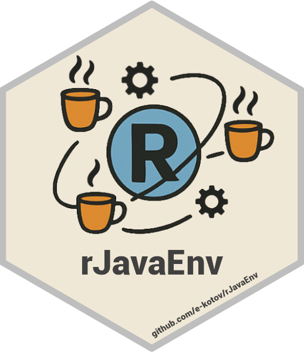

<!-- README.md is generated from README.Rmd. Please edit that file -->

# rJavaEnv: Java Environments for R Projects <a href="https://www.ekotov.pro/rJavaEnv/"></a>

<!-- badges: start -->

[](https://www.repostatus.org/#active)
<a href="https://lifecycle.r-lib.org/articles/stages.html#stable"
target="_blank"></a>
<a href="https://CRAN.R-project.org/package=rJavaEnv"
target="_blank"></a>
<a href="https://CRAN.R-project.org/package=rJavaEnv"
target="_blank"></a>
[](https://github.com/e-kotov/rJavaEnv/actions/workflows/R-CMD-check.yaml)
<!-- [](https://github.com/e-kotov/rJavaEnv/actions?query=workflow%3Apkgcheck) -->
[](https://app.codecov.io/github/e-kotov/rJavaEnv)

[](https://doi.org/10.32614/CRAN.package.rJavaEnvi)
[](https://doi.org/10.5281/zenodo.11403009)

<!-- badges: end -->

Solve common issues with `Java` environment management in `R` for users
of `Java`/`{rJava}`-dependent `R` packages such as `{r5r}`,
`{opentripplanner}`, `{xlsx}`, `{openNLP}`, `{rWeka}`, `{RJDBC}`,
`{tabulapdf}`, and many more. `{rJavaENv}` prevents common problems like
`Java` not found, `Java` version conflicts, missing `Java`
installations, and the inability to install `Java` due to lack of
administrative privileges. `rJavaEnv` automates the download,
installation, and setup of the `Java Development Kit` (`JDK`) on a
per-project basis by setting the relevant `JAVA_HOME` in the current `R`
session or the current working directory (via `.Rprofile`, with the
user’s consent). Similar to what `renv` does for `R` packages,
`rJavaEnv` allows different `Java` versions to be used across different
projects, but can also be configured to allow multiple versions within
the same project (e.g. with the help of `{targets}` package). **Note:
there are a few extra steps for ‘Linux’ users, who don’t have any ‘Java’
previously installed in their system, and who prefer package
installation from source, rather then installing binaries from ‘Posit
Package Manager’. See
[documentation](https://www.ekotov.pro/rJavaEnv/articles/rJavaEnv.html#note-linux)
for details.**

## Install

Install from CRAN:

``` r
install.packages('rJavaEnv')
```

Install latest release from **R-multiverse**:

``` r
install.packages('rJavaEnv',
 repos = c('https://community.r-multiverse.org', 'https://cloud.r-project.org')
)
```

You can also install the development version of `rJavaEnv` from GitHub:

``` r
if (!requireNamespace("remotes", quietly = TRUE)) {
  install.packages("remotes")
}

remotes::install_github("e-kotov/rJavaEnv")
```

## Simple Example

``` r
rJavaEnv::java_quick_install(version = 21)
```

This will:

- download `Java` 21 distribution compatible with the current operating
  system and processor architecture into a local cache folder;

- extract the downloaded `Java` distribution into another cache folder;

- create a symbolic link (for macOS and Linux) or junction (for Windows,
  if that fails, just copies the files)
  **rjavaenv/`platform`/`processor_architecture`/`java_version`** in the
  current directory/project to point to the cached installation;

- set the current session’s `JAVA_HOME` and `PATH` environment variables
  to point to the installed (symlinked) `Java` distribution;

- add code to `.Rprofile` file in the current directory/project to set
  `JAVA_HOME` and `PATH` environment variables when the project is
  opened in RStudio.

As part of normal operation, `rJavaEnv` will update the `JAVA_HOME` and
`PATH` environment variables in the current R session, the local cache
in your R package library, and the `.Rprofile` file in the
project/current working directory. In line with [CRAN
policies](https://cran.r-project.org/web/packages/policies.html),
explicit user consent is required before making these changes.
Therefore, the first time you run any function from `rJavaEnv` that
makes such changes, you will be asked for consent. To explicitly consent
and/or to prevent interruptions in non-interactive mode, you can use the
`rje_consent()` function:

``` r
rje_consent(provided = TRUE)
```

## Using `rJavaEnv` with `targets` and `callr`

Just insert this line into the begining of any script that you run with
`targets` or `callr`:

``` r
rJavaEnv::use_java("21")
```

More details are in the vignette [Multiple `Java` environments in one
project with `targets` and
`callr`](https://www.ekotov.pro/rJavaEnv/articles/multiple-java-with-targets-callr.qmd).

## Functions Overview

The package has several core functions:

1.  `java_quick_install()`
    - Downloads, installs, and sets Java environment in the current
      working/project directory, all in one line of code.
2.  `java_check_version_cmd()`
    - Checks the installed Java version using terminal commands. For
      packages like
      <a href="https://github.com/ropensci/opentripplanner"
      target="_blank"><code>opentripplanner</code></a>, that performs
      Java calls using command line.
3.  `java_version_check_rjava()`
    - Checks the installed `Java` version using `rJava` in a separate R
      session. For `rJava`-dependent packages such as
      <a href="https://github.com/ipeaGIT/r5r"
      target="_blank"><code>r5r</code></a>.
4.  `java_download()`
    - Downloads a specified version and distribution of `Java`.
5.  `java_install()`
    - Installs a `Java` distribution file into current (or
      user-specified) project directory.
6.  `java_env_set()`
    - Sets the `JAVA_HOME` and `PATH` environment variables to a given
      path in current R session and/or in the `.Rprofile` file in the
      project directory.
7.  `java_env_unset()`
    - Remove the `JAVA_HOME` and `PATH` environment variables from the
      `.Rrpofile` file in the project directory (but not in the current
      R session, please restart the session so that R picks up the
      system Java).
8.  `java_list()`
    - Lists all or some `Java` versions linked in the current project
      (or cached distributions or installations).
9.  `java_clear()`
    - Removes all or some `Java` versions linked in the current project
      (or cached distributions or installations).

See more details on all the functions in the
<a href="https://www.ekotov.pro/rJavaEnv/reference/index.html"
target="_blank">Reference</a>.

For detailed usage, see the [Quick Start
Vignette](https://www.ekotov.pro/rJavaEnv/articles/rJavaEnv.html) (work
in progress).

## Limitations

Currently, `rJavaEnv` only supports major `Java` versions such as 8, 11,
17, 21, 22. The download and install functions ignore the minor version
of the `Java` distribution and just downloads the latest stable
subversion of the specified major version. This is done to simplify the
process and avoid the need to update the package every time a new minor
version of `Java` is released. For most users this should be sufficient,
but this is substandard for full reproducibility.

The main limitation is that if you want to switch to another `Java`
environment, you will most likely have to restart the current R session
and set the `JAVA_HOME` and `PATH` environment variables to the desired
`Java` environment using `rJavaEnv::java_env_set()`. This cannot be done
dynamically within the same R session due to the way Java is initialized
in R, particularly with the `rJava`-dependent packages such as
<a href="https://github.com/ipeaGIT/r5r"
target="_blank"><code>r5r</code></a>. With packages like
<a href="https://github.com/ropensci/opentripplanner"
target="_blank"><code>opentripplanner</code></a>, that performs `Java`
calls using command line, you can switch `Java` environments dynamically
within the same R session as much as you want.

Therefore, if you need to use R packages that depend on different `Java`
versions within the same project, you will have to create separate R
scripts for each `Java` environment and run them in separate R sessions.
One effective way of doing this is to use the
<a href="https://github.com/r-lib/callr"
target="_blank"><code>callr</code></a> package to run R scripts in
separate R sessions. Another option is to use the
<a href="https://github.com/ropensci/targets"
target="_blank"><code>targets</code></a> package to manage the whole
project workflow, which, as a side effect, will lead to all R scripts
being run in separate R sessions. To use `rJavaEnv` with `targets`, you
will need to download and install several Java environments using
`rJavaEnv::java_download()` and `rJavaEnv::java_install()` and set the
relevant path with `rJavaEnv::java_env_set()` at the beginning of each
function that requires a certain `Java` version.

## Future work

The future work includes:

- Add support for more `Java` distributions and versions

- Take care of <a
  href="https://solutions.posit.co/envs-pkgs/using-rjava/#reconfigure-r"
  target="_blank"><code>R CMD javareconf</code></a>

- Possibly add support for specifying `Java` version beyond the major
  version

- Possibly allow downloading several `Java` distributions in one
  function call, e.g. different major versions of the same ‘flavour’ or
  different ‘flavours’ of the same major version

- Possibly add automation to get the `Java` that is required by specific
  `Java`-dependent R packages

I am open to suggestions and contributions, welcome to
<a href="https://github.com/e-kotov/rJavaEnv/issues"
target="_blank">issues</a> and
<a href="https://github.com/e-kotov/rJavaEnv/pulls" target="_blank">pull
requests</a>.

## Acknowledgements

I thank rOpenSci for the
<a href="https://devguide.ropensci.org/" target="_blank">Dev Guide</a>,
as well as Hadley Wickham and Jennifer Bryan for the
<a href="https://r-pkgs.org/" target="_blank">R Packages</a> book.

Package hex sticker logo is partially generated by DALL-E by OpenAI. The
logo also contains the original R logo.

## Citation

To cite package ‘rJavaEnv’ in publications use:

Kotov E (2024). *rJavaEnv: Java Environments for R Projects*.
doi:10.32614/CRAN.package.rJavaEnv
<https://doi.org/10.32614/CRAN.package.rJavaEnv>,
<https://github.com/e-kotov/rJavaEnv>.

BibTeX:

    @Manual{rjavaenv,
      title = {rJavaEnv: Java Environments for R Projects},
      author = {Egor Kotov},
      year = {2024},
      url = {https://github.com/e-kotov/rJavaEnv},
      doi = {10.32614/CRAN.package.rJavaEnv},
    }
