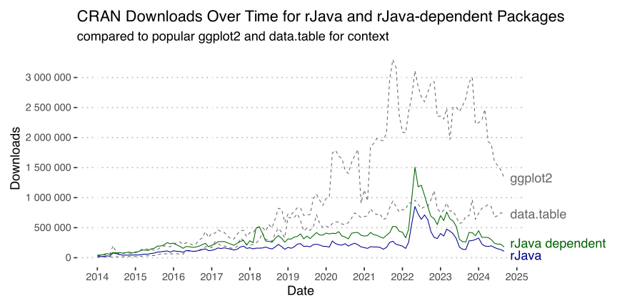
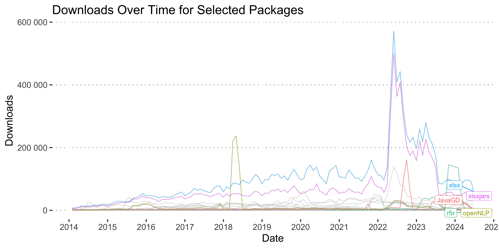
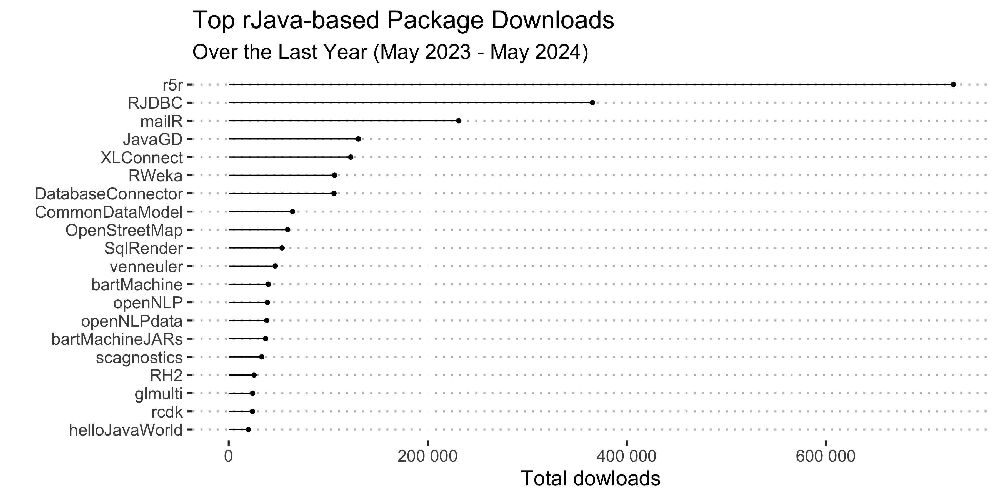

# Why rJavaEnv: the landscape of ‘Java’-dependent R packages

## Overall popularity of Java-dependent R packages

While not as popular as widely known and highly popular ggplot2 and
data.table packages, and rJava-dependent packages (104 on CRAN and
another 14 on Bioconductor) (and consequently, rJava itself ) are widely
used in the R community (see [Figure 1](#fig-rJavaPopularity)). The
rJava ([Urbanek 2024](#ref-rjava)) itself was downloaded 107,725 times
in September, 2024. The total number of downloads for rJava-dependent
packages was 178,185 on CRAN and 3,565 on Bioconductor. To put this into
context, ggplot2 was downloaded 1,329,676 times and data.table was
downloaded 729,796 times in September, 2024. So rJava-based packages
collectively are 7.5 times less popular than ggplot2, but they have a
noticeable number of users.

Figure 1: CRAN Downloads Over Time for rJava and rJava-dependent
Packages, compared to popular ggplot2 and data.table for context

Note that the analysis above only covers packages that are available on
CRAN and Bioconductor and only those that explicitly depend on the
`rJava` package. There are other packages that use `Java` but do not
depend on the `rJava` package. For example, the
[`{opentripplanner}`](https://github.com/ropensci/opentripplanner)
package also relies on underlying Java-based software but calls it from
the command line. This, however, also requires system environment
variables to be set up correctly.

Identifying packages such as `opentripplanner` is more complicated, as
they do not have a direct dependency on the `rJava` package. We can
assume that there are not as many of them compared to those that depend
on `rJava.`

## Individual Java-dependent packages

If we zoom in to the individual `rJava`-dependent packages, we will see
in [Figure 2](#fig-rJavaDepIndivAll), that most downloads are generated
by `xlsx` and its “companion” `xlsxjars`.

Figure 2: CRAN Downloads Over Time for all rJava-dependent Packages

If we remove `xlsx` (and `xlsxjars`) as an outlier, we will see in
[Figure 3](#fig-rJavaDepIndivFiltered)), that top packages are:

- [`r5r`](https://github.com/ipeaGIT/r5r) for *“rapid realistic routing
  on multimodal transport networks (walk, bike, public transport and
  car)”* ([Pereira et al. 2021](#ref-pereira_r5r_2021)). The package
  users experience multiple issues with Java and report them on GitHub,
  just few examples include
  [1](https://github.com/ipeaGIT/r5r/issues/372),
  [2](https://github.com/ipeaGIT/r5r/issues/374),
  [3](https://github.com/ipeaGIT/r5r/issues/338) and [many
  more](https://github.com/ipeaGIT/r5r/issues).

- [`RJDBC`](https://www.rforge.net/RJDBC/) that *“\[p\]rovides Access to
  Databases Through the JDBC Interface”* ([Urbanek 2022](#ref-rjdbc)). I
  was not able to find a bug tracker for this package, but a simple web
  search reveals multiple issues such as [this
  one](https://stackoverflow.com/questions/45338197/r-cannot-find-java-home-when-using-java-jdk-1-8-rjava-wont-work)
  on StackOverflow.

- [`mailR`](https://github.com/rpremrajGit/mailR) for *“send\[ing\]
  emails from R”* ([Premraj 2021](#ref-mailr)) (has a Java related
  [issue](https://github.com/rpremrajGit/mailR/issues/9) on GitHub). Web
  search also reveals StackOverflow
  [discussions](https://stackoverflow.com/questions/61871960/r-mailr-package-not-loading-java)
  related to Java version issues.

- [`RWeka`](https://doi.org/10.32614/CRAN.package.RWeka), R interface to
  Weka. Weka itself *“is a collection of machine learning algorithms for
  data mining tasks written in Java*” ([Hornik, Buchta, and Zeileis
  2009](#ref-rweka)). StackOverflow
  [discussions](https://stackoverflow.com/questions/40752070/issues-installing-rweka)
  related to Java version issues.

Figure 3: CRAN Downloads Over Time for top 20 rJava-dependent Packages

Some other packages:

- [`openNLP`](https://doi.org/10.32614/CRAN.package.openNLP). *“OpenNLP
  library is a machine learning based toolkit for the processing of
  natural language text written in Java”* ([Hornik 2019](#ref-opennlp)).
  It also has Java related issues
  [discussed](https://stackoverflow.com/questions/37014340/installing-r-package-opennlp-in-r)
  on StackOverflow.

- [`xlsx`](https://github.com/colearendt/xlsx). *“An R package to
  interact with Excel files using the Apache POI \[J\]ava library”*
  ([Dragulescu and Arendt 2020](#ref-xlsx)). Also many discussions on
  both
  [StackOverflow](https://stackoverflow.com/questions/62012760/r-xlsx-package-can-not-be-used)
  and [GitHub](https://github.com/colearendt/xlsx/issues/183).

To summarize, regardless of the Java-dependent R package being used,
users consistently encounter issues with having the correct Java runtime
installed on their system. Additionally, they may be using various R
packages that depend on different Java versions, complicating the
management of Java environment variables. This task is particularly
challenging for ordinary users who simply want to get their analysis
running smoothly and efficiently.

## `rJavaEnv` R package as a solution

`rJavaEnv` aims to assist users of all `Java`/`rJava`-dependent packages
by providing functions to quickly install the required `Java` version
and set environment variables. This ensures that the packages the user
plans to use pick up the correct Java version with minimal intervention
to the user’s system. Compared to manually downloading `Java` from
Oracle, Amazon, or another vendor and installing it using the installer,
`rJavaEnv` downloads non-installer archives of `Java`, extracts them to
a cache folder, and links them in the current project or working
directory. This way, `rJavaEnv` does not contaminate the user’s machine
with unnecessary installations and configurations.

Furthermore, `rJavaEnv` streamlines the process, allowing users to focus
on their analysis without worrying about complex `Java` setup issues. By
automating these tasks, `rJavaEnv` reduces the potential for errors and
ensures a smoother experience for users who need to manage multiple
Java-dependent R packages.

## References

Dragulescu, Adrian, and Cole Arendt. 2020. *Xlsx: Read, Write, Format
Excel 2007 and Excel 97/2000/XP/2003 Files*.
<https://CRAN.R-project.org/package=xlsx>.

Hornik, Kurt. 2019. *openNLP: Apache OpenNLP Tools Interface*.
<https://CRAN.R-project.org/package=openNLP>.

Hornik, Kurt, Christian Buchta, and Achim Zeileis. 2009. “Open-Source
Machine Learning: R Meets Weka.” *Computational Statistics* 24 (2):
225–32. <https://doi.org/10.1007/s00180-008-0119-7>.

Pereira, Rafael H. M., Marcus Saraiva, Daniel Herszenhut, Carlos Kaue
Vieira Braga, and Matthew Wigginton Conway. 2021. “R5r: Rapid Realistic
Routing on Multimodal Transport Networks with R$^{\text{5}}$ in r.”
*Findings*, March. <https://doi.org/10.32866/001c.21262>.

Premraj, Rahul. 2021. *mailR: A Utility to Send Emails from r*.
<https://CRAN.R-project.org/package=mailR>.

Urbanek, Simon. 2022. *RJDBC: Provides Access to Databases Through the
JDBC Interface*. <https://CRAN.R-project.org/package=RJDBC>.

———. 2024. *rJava: Low-Level r to Java Interface*.
<https://CRAN.R-project.org/package=rJava>.
