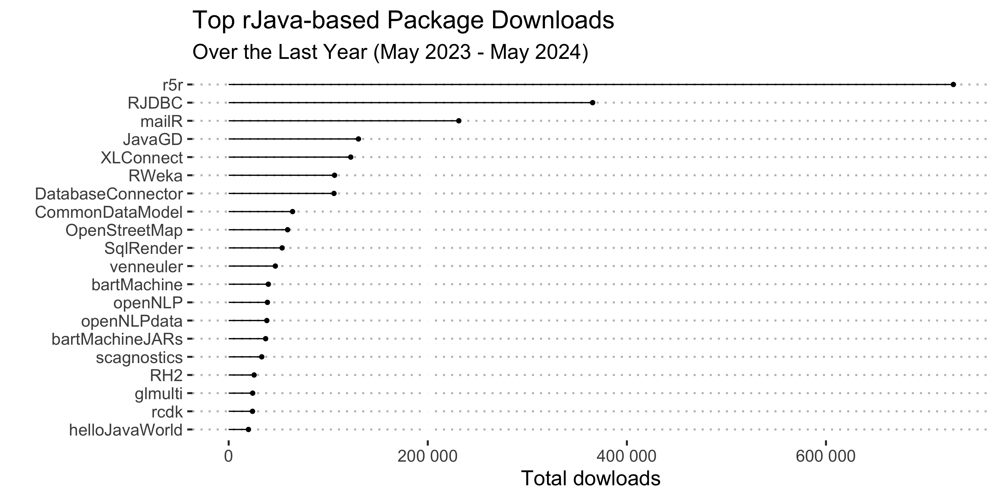

```{r, include = FALSE}
knitr::opts_chunk$set(
collapse = TRUE,
comment = "#>",
fig.path = "man/figures/README-",
out.width = "100%",
message = FALSE,
warning = FALSE
)
```

```{r setup, include = FALSE}
if (!requireNamespace("pacman", quietly = TRUE)) {
  install.packages("pacman")
}
package_list <- c("tidyverse", "scales", "ggpubr", "directlabels", "lubridate", "gghighlight")
pacman::p_load(char = package_list)
rm(package_list)
```

```{r load_data, include=FALSE, echo=FALSE}
rJava_dlstats <- readr::read_csv2("data-for-vignettes/rJava_dlstats.csv")
rJava_dependants_dlstats_cran <- readr::read_csv2("data-for-vignettes/rJava_dependants_dlstats_cran.csv")
rJava_dependants_dlstats_bioc <- readr::read_csv2("data-for-vignettes/rJava_dependants_dlstats_bioc.csv")
data_table_dlstats <- readr::read_csv2("data-for-vignettes/data_table_dlstats.csv")
ggplot2_dlstats <- readr::read_csv2("data-for-vignettes/ggplot2_dlstats.csv")

cutoff_date <- "2024-05-31"
```

## Overall popularity of Java-dependent R packages

While not as popular as widely known and highly popular `ggplot2` and `data.table` packages, and `rJava`-dependent packages (`r length(unique(rJava_dependants_dlstats_cran$package))` on CRAN and another `r length(unique(rJava_dependants_dlstats_bioc$package))` on Bioconductor) (and consequently, `rJava` itself ) are widely used in the R community (see Fig. \@ref(fig:rJavaPopularity)). The `rJava` [@rjava] itself was downloaded `r rJava_dlstats |> filter(end == cutoff_date) |> pull(downloads) |> comma()` times in `r format(as.Date(cutoff_date), "%B, %Y")`. The total number of downloads for `rJava`-dependant packages was `r rJava_dependants_dlstats_cran |> filter(end == cutoff_date) |> summarise(total = sum(downloads, na.rm = T)) |> pull(total) |> comma()` on CRAN and `r rJava_dependants_dlstats_bioc |> filter(end == cutoff_date) |> summarise(total = sum(Nb_of_downloads, na.rm = T)) |> pull(total) |> comma()` on Bioconductor. To put this into context, `ggplot2` was downloaded `r ggplot2_dlstats |> filter(end == cutoff_date) |> pull(downloads) |> comma()` times and `data.table` was downloaded `r data_table_dlstats |> filter(end == cutoff_date) |> pull(downloads) |> comma()` times in `r format(as.Date(cutoff_date), "%B, %Y")`. So `rJava`-based packages collectively are `r round(ggplot2_dlstats |> filter(end == cutoff_date) |> pull(downloads) / rJava_dependants_dlstats_cran |> filter(end == cutoff_date) |> summarise(total = sum(downloads, na.rm = T)) |> pull(total), 1)` times less popular than `ggplot2`, but they have a noticeable number of users.


```{r transform_data, include=FALSE, echo=FALSE}
rj_and_rj_dep_total_down <- rJava_dependants_dlstats_cran |> 
  rbind(rJava_dlstats) |>
  rbind(data_table_dlstats) |>
  rbind(ggplot2_dlstats) |>
  mutate(is_rJava = if_else(package == "rJava", "rJava", "rJava dependent")) |> 
  mutate(is_rJava = if_else(package == "ggplot2", "ggplot2", is_rJava)) |> 
  mutate(is_rJava = if_else(package == "data.table", "data.table", is_rJava)) |>
  group_by(start, end, is_rJava) |> 
  summarise(downloads = sum(downloads, na.rm = T), .groups = "keep") |>
  ungroup()
```

```{r rJavaPopularity, fig.cap="CRAN Downloads Over Time for rJava and rJava-dependent Packages, compared to popular ggplot2 and data.table for context", echo = FALSE, fig.width=12, fig.height=6}
knitr::include_graphics("media/images/rJavaPopularity.png")
```

Note that the analysis above only covers packages that are available on CRAN and Bioconductor and only those that explicitly depend on the `rJava` package. There are other packages that use `Java` but do not depend on the `rJava` package. For example, the [`opentripplanner`](https://github.com/ropensci/opentripplanner){target="_blank"} package also relies on underlying Java-based software but calls it from the command line. This, however, also requires system environment variables to be set up correctly.

Identifying packages such as `opentripplanner` is more complicated, as they do not have a direct dependency on the `rJava` package. We can assume that there are not as many of them compared to those that depend on `rJava.`


## Individual Java-dependent packages

If we zoom in to the individual `rJava`-dependent packages, we will see (Fig. \@ref(fig:rJavaDepIndivAll)), that most donwloads are generated by `xlsx` and its "companion" `xlsxjars`.

```{r rJavaDepIndivAll, fig.cap="CRAN Downloads Over Time for rJava and rJava-dependent Packages, compared to popular ggplot2 and data.table for context", echo = FALSE, fig.width=12, fig.height=6}
knitr::include_graphics("media/images/rJavaDepIndivAll.png")
```

If we remove `xlsx` (and `xlsxjars`) as an outlier, we will see (Fig. \@ref(fig:rJavaDepIndivFiltered)), that top packages are:

- [`r5r`](https://github.com/ipeaGIT/r5r){target="_blank"} for *"rapid realistic routing on multimodal transport networks (walk, bike, public transport and car)"* [@pereira_r5r_2021]. The package users experience multiple issues with Java and report them on GitHub, just few examples include [1](https://github.com/ipeaGIT/r5r/issues/372){target="_blank"}, [2](https://github.com/ipeaGIT/r5r/issues/374){target="_blank"}, [3](https://github.com/ipeaGIT/r5r/issues/338){target="_blank"} and [many more](https://github.com/ipeaGIT/r5r/issues){target="_blank"}.

- [`RJDBC`](https://www.rforge.net/RJDBC/){target="_blank"} that *"[p]rovides Access to Databases Through the JDBC Interface"* [@rjdbc]. I was not able to find a bug tracker for this package, but a simple web search reveals multiple issues such as [this one](https://stackoverflow.com/questions/45338197/r-cannot-find-java-home-when-using-java-jdk-1-8-rjava-wont-work){target="_blank"} on StackOverflow.

- [`mailR`](https://github.com/rpremrajGit/mailR){target="_blank"} for *"send[ing] emails from R"* [@mailr]  (has a Java related [issue](https://github.com/rpremrajGit/mailR/issues/9){target="_blank"} on GitHub). Web search also reveals StackOverflow [discussions](https://stackoverflow.com/questions/61871960/r-mailr-package-not-loading-java){target="_blank"} related to Java version issues.

 - [`RWeka`](https://doi.org/10.32614/CRAN.package.RWeka){target="_blank"}, R interface to Weka. Weka itself *"is a collection of machine learning algorithms for data mining tasks written in Java*" [@rweka]. StackOverflow [discussions](https://stackoverflow.com/questions/40752070/issues-installing-rweka){target="_blank"} related to Java version issues.


```{r rJavaDepIndivFiltered, fig.cap="CRAN Downloads Over Time for rJava and rJava-dependent Packages, compared to popular ggplot2 and data.table for context", echo = FALSE, fig.width=12, fig.height=6}

```

Some other packages:

- [`openNLP`](https://doi.org/10.32614/CRAN.package.openNLP){target="_blank"}. *"OpenNLP library is a machine learning based toolkit for the processing of natural language text written in Java"* [@opennlp]. It also has Java related issues [discussed](https://stackoverflow.com/questions/37014340/installing-r-package-opennlp-in-r){target="_blank"} on StackOverflow.

- [`xlsx`](https://github.com/colearendt/xlsx){target="_blank"}. *"An R package to interact with Excel files using the Apache POI [J]ava library"* [@xlsx]. Also many discussions on both [StackOverflow](https://stackoverflow.com/questions/62012760/r-xlsx-package-can-not-be-used){target="_blank"} and [GitHub](https://github.com/colearendt/xlsx/issues/183){target="_blank"}.


To summarize, regardless of the Java-dependent R package being used, users consistently encounter issues with having the correct Java runtime installed on their system. Additionally, they may be using various R packages that depend on different Java versions, complicating the management of Java environment variables. This task is particularly challenging for ordinary users who simply want to get their analysis running smoothly and efficiently.

## `rJavaEnv` R package as a solution

`rJavaEnv` aims to assist users of all `Java`/`rJava`-dependent packages by providing functions to quickly install the required `Java` version and set environment variables. This ensures that the packages the user plans to use pick up the correct Java version with minimal intervention to the user's system. Compared to manually downloading `Java` from Oracle, Amazon, or another vendor and installing it using the installer, `rJavaEnv` downloads non-installer archives of `Java`, extracts them to a cache folder, and links them in the current project or working directory. This way, `rJavaEnv` does not contaminate the user's machine with unnecessary installations and configurations.

Furthermore, `rJavaEnv` streamlines the process, allowing users to focus on their analysis without worrying about complex `Java` setup issues. By automating these tasks, `rJavaEnv` reduces the potential for errors and ensures a smoother experience for users who need to manage multiple Java-dependent R packages.

## References
